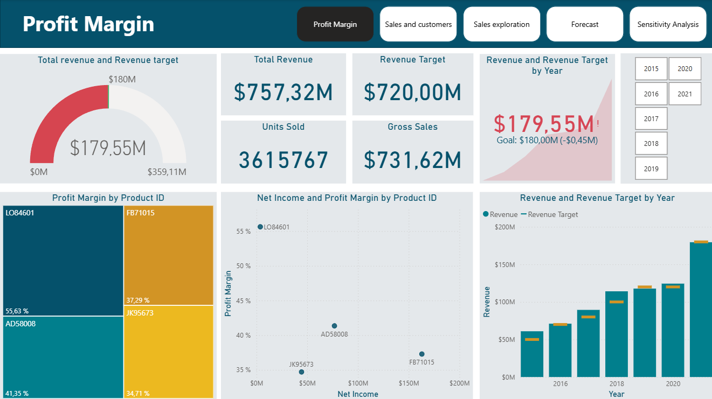

# Financial Analysis and Forecasting (Power BI)

## Overview
This project analyzes the financial performance of Spaero Technology, an aerospace manufacturing company. Using Power BI, the dashboard provides insights into sales performance, revenue forecasting, and sensitivity analysis from 2015 to 2021.

## 🎯Business Questions
1. How has total revenue evolved from 2015 to 2021?
2. Did the company achieve its annual revenue targets?
3. Which products generate the highest profit margins?
4. What is the expected future revenue under different growth scenarios?
5. How do changes in sales rates and discount/premium strategies impact gross sales?

## 🗝️Key Metrics
- Total Revenue = SUM(Sales_Fact[Revenue])
- Net Income = SUMX(Sales_Fact, Sales_Fact[Revenue]) - SUMX(Sales_Fact, Sales_Fact[COGS])
- Profit Margin = Net Income ÷ Total Revenue
- Revenue Growth % (YoY) = CALCULATE([Revenue Growth %], SAMEPERIODLASTYEAR('Calendar'[Date]))
- Straight Line Forecast = [Total revenue last year] × (1 + [Revenue Growth % Last Year])
- Scenario Forecast = [Total revenue last year] × (1 + Growth Rate Scenario Value)
- Sensitivity Analysis Metrics: Discount/Premium Scenario, Revenue Sensitivity

## 💡Insights
- Revenue performance increased steadily between 2015 and 2021, with the highest growth observed in 2021.
- The company’s total revenue ($757.32M) exceeded the defined target ($720M).
- Certain products achieved higher profit margins, with some exceeding 55%, while others performed below average.
- Forecast analysis shows that under optimistic growth scenarios, revenue could increase.
- Sensitivity analysis demonstrates that small changes in sales rates and discount policies significantly affect gross sales and overall profitability.

## ✅Recommendations
1. Focus on high-margin products to maximize profitability and allocate more resources to them.
2. Monitor sales discounts and premium strategies carefully, since small variations have a major impact on gross sales.
3. Adopt forecasting scenarios for strategic planning, using both conservative and optimistic growth models to prepare for market fluctuations.

## Visualization

